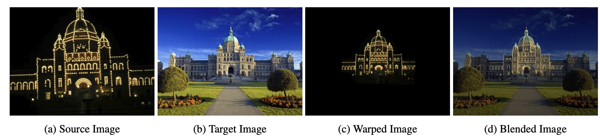

# LIFE: Lighting Invariant Flow Estimation
### [Project Page](https://drinkingcoder.github.io/publication/life/) | [Paper](https://arxiv.org/abs/2104.03097)
</br>

> LIFE: Lighting Invariant Flow Estimation \
> [Zhaoyang Huang](https://drinkingcoder.github.io)<sup>\*</sup>, Xiaokun Pan<sup>\*</sup>, Runsen Xu, Yan Xu, Ka Chun Cheung, Guofeng Zhang, [Hongsheng Li](https://www.ee.cuhk.edu.hk/~hsli/)




### Requirements
```
conda env create -f environment.yaml
conda activate life
```

### Demos

1. For single image warping, please refer to the `notebooks/flow_warp.ipynb`.
2. LIFE can robustly align a picture to an image under significant lighting variation. To synthesize an image with realistic lighting conditions, please refer to our previous work [NIID-Net](https://zju3dv.github.io/niid/).
3. To play a movie on the paper, please refer to [DEMO.md](demo/DEMO.md)


### Training
Comming soon.

### Evaluation
#### KITTI
```
cd evaluation
python kitti_eval.py --model PATH_To_MODEL --version 2012/2015 --data_dir PATH_TO_KITTI_DATASET
```

### Acknowledgements
Our neural network architecture is mainly built upon [RAFT](https://github.com/princeton-vl/RAFT/).